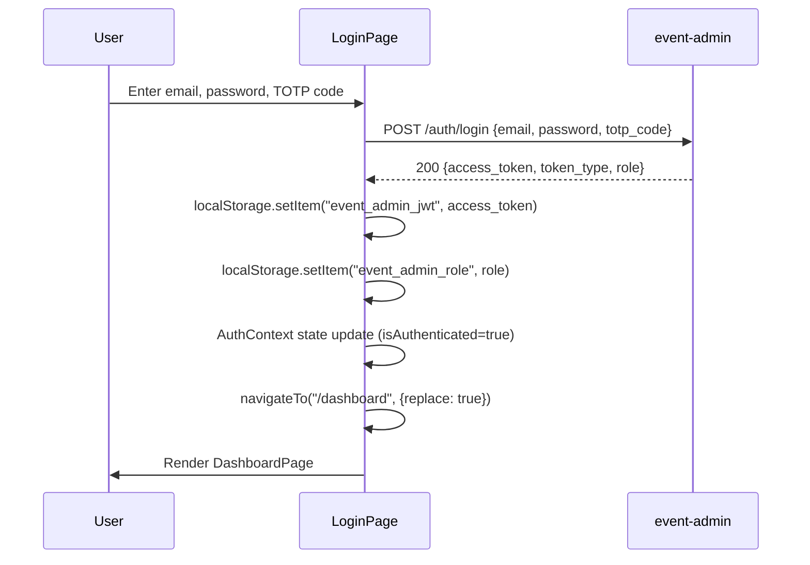
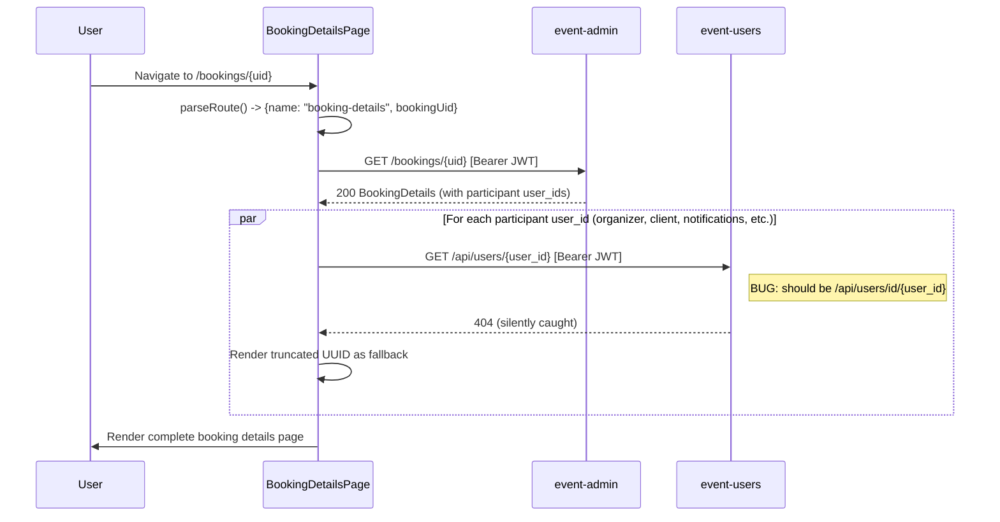

# event-admin-frontend -- API Contracts

## Calls to event-admin (`VITE_API_BASE_URL`)

All requests go through `apiRequest()` in `src/modules/shared/api.ts:24-64`.  
Auth: `Authorization: Bearer <JWT from localStorage>` (unless `auth: false`).

### POST /auth/login

- **Source**: `authApi.ts:4-9`
- **Auth**: None (`auth: false`)
- **Request body**:
  ```json
  {
    "email": "string",
    "password": "string",
    "totp_code": "string"
  }
  ```
- **Response** (200):
  ```json
  {
    "access_token": "string (JWT)",
    "token_type": "Bearer",
    "role": "admin | user"
  }
  ```
- **Types**: `LoginPayload`, `LoginResponse` in `auth/types.ts:1-11`

### POST /auth/logout

- **Source**: `authApi.ts:12-14`
- **Auth**: Bearer JWT
- **Request body**: None
- **Response**: 204 No Content (or ignored on failure)

### GET /bookings

- **Source**: `bookingsApi.ts:15-31`
- **Auth**: Bearer JWT
- **Query params** (all optional, repeatable):
  - `booking_uids` (string[])
  - `current_statuses` (string[])
  - `current_organizer_user_ids` (string[])
  - `current_client_user_ids` (string[])
- **Response** (200): `BookingListItem[]`
  ```json
  [
    {
      "id": "number",
      "booking_uid": "string",
      "first_seen_at": "ISO datetime",
      "last_seen_at": "ISO datetime",
      "start_time": "ISO datetime | null",
      "end_time": "ISO datetime | null",
      "current_status": "string | null",
      "created_at": "ISO datetime",
      "updated_at": "ISO datetime",
      "organizer_participant": { "user_id": "string | null" } | null,
      "client_participant": { "user_id": "string | null" } | null
    }
  ]
  ```
- **Types**: `bookings/types.ts:5-18`

### GET /bookings/{uid}

- **Source**: `bookingsApi.ts:33-39`
- **Auth**: Bearer JWT
- **Path param**: `uid` (booking UID, URL-encoded)
- **Response** (200): `BookingDetails`
  ```json
  {
    "id": "number",
    "booking_uid": "string",
    "start_time": "ISO datetime | null",
    "end_time": "ISO datetime | null",
    "current_status": "string | null",
    "created_at": "ISO datetime",
    "current_organizer_participant": { "user_id": "string | null" } | null,
    "current_client_participant": { "user_id": "string | null" } | null,
    "organizer_history": [{ "id": "number", "organizer_participant": {...}, "effective_from": "ISO datetime" }],
    "meeting_links": [{ "id": "number", "participant": {...}, "meeting_url": "string", "created_at": "ISO datetime" }],
    "email_notifications": [{ "id": "number", "participant": {...} | null, "trigger_event": "string | null", "sent_at": "ISO datetime | null", "last_status": "string | null", "status_history": [...] }],
    "telegram_notifications": [{ "id": "number", "participant": {...} | null, "trigger_event": "string | null", "source_event_id": "string", "sent_at": "ISO datetime", "created_at": "ISO datetime" }],
    "chat_events": [{ "id": "number", "chat_event_type": "string", "participant": {...} | null, "is_read": "boolean | null", "text_preview": "string | null", "occurred_at": "ISO datetime", "updated_at": "ISO datetime" }],
    "video_events": [{ "id": "number", "raw_event_id": "string", "video_event_type": "string", "participant_role": "string | null", "participant": {...} | null, "event_time": "ISO datetime | null", "payload": "object" }]
  }
  ```
- **Types**: `bookings/types.ts:30-103`
- **Note**: On 404, the code retries the same request (bug -- `bookingsApi.ts:34-38`)

### GET /bookings/future-email-bounced

- **Source**: `bookingsApi.ts:42-44`
- **Auth**: Bearer JWT
- **Response** (200): `FutureEmailBouncedBooking[]`
  ```json
  [
    {
      "id": "number",
      "booking_uid": "string",
      "start_date": "string",
      "end_time": "ISO datetime | null",
      "current_status": "string | null",
      "organizer_participant": {...} | null,
      "client_participant": {...} | null,
      "email_bounce_statuses": ["string"]
    }
  ]
  ```
- **Types**: `bookings/types.ts:20-28`

---

## Calls to event-users (`VITE_USERS_API_BASE_URL`)

All requests go through `usersApiRequest()` in `participantsApi.ts:42-44`, which delegates to the shared `apiRequest()` with a different `baseUrl`.  
Auth: Same Bearer JWT from localStorage (despite docs mentioning a static token, the code uses the user's JWT).

### GET /api/users

- **Source**: `participantsApi.ts:46-54`
- **Auth**: Bearer JWT
- **Query params** (all optional):
  - `email` (string) -- filter by email
  - `role` (string) -- filter by role
  - `limit` (number)
  - `offset` (number)
- **Response** (200): `ListUsersResponse`
  ```json
  {
    "items": [
      {
        "id": "UUID string",
        "email": "string",
        "name": "string | null",
        "role": "string",
        "time_zone": "string | null",
        "contacts": [
          {
            "id": "string",
            "user_id": "string",
            "channel": "string",
            "contact_id": "string",
            "created_at": "ISO datetime",
            "updated_at": "ISO datetime"
          }
        ],
        "created_at": "ISO datetime",
        "updated_at": "ISO datetime"
      }
    ],
    "total": "number",
    "limit": "number",
    "offset": "number"
  }
  ```
- **Types**: `participantsApi.ts:5-36`

### GET /api/users/{id}  (BUG -- should be /api/users/id/{id})

- **Source**: `participantsApi.ts:56-58`
- **Auth**: Bearer JWT
- **Path param**: `id` (user UUID, URL-encoded)
- **Intended response** (200): `UserItem` (same shape as items above)
- **Actual behavior**: Returns 404 because the backend route is `/api/users/id/{user_id}`. The error is swallowed in `UserInfo.tsx:21-23`, resulting in truncated UUID display.

---

## Sequence Diagrams

### Login Flow



**References**: `LoginPage.tsx`, `authApi.ts:4-9`, `AuthContext.tsx:30-35`, `App.tsx:36-38`

### Booking Detail Load



**References**: `BookingDetailsPage.tsx:222-248`, `bookingsApi.ts:33-39`, `UserInfo.tsx:13-30`, `participantsApi.ts:56-58`
